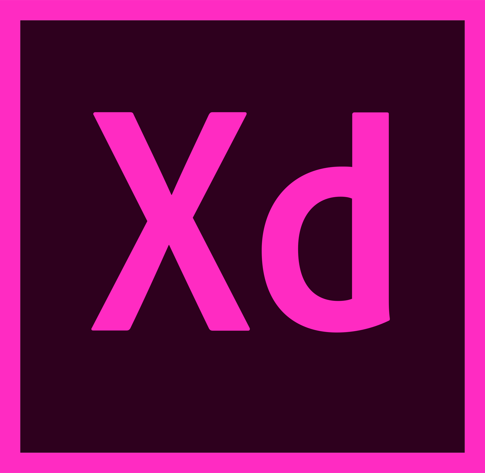

# Hi, im Jacek Mickiewicz! 

> I'm an aspiring Front End Developer. 

>  Welcome and thanks for taking the time to visit my domain!

## ABOUT ME

- 📖 I’m self learning developer focused on Front-End

- 👨‍💻 I’m experienced with Javascript, React, Typescript

- 🌱 I’m currently learning Redux & Next.js

- 🏠 Based in Wroclaw, Poland

- 💻 I am currently building a portfolio in the meantime by attending the Coders Camp

- 💬 I'm open for job opportunities

### ⌨ Programming Tools

### 🎨 Design & management Tools

### 📜 In the process of introducing 

### ☎ Contact with me 
<h3>- 📧 <a href="mailto:mickiewicz.jacek@o2.pl">mickiewicz.jacek@o2.pl</a> </h3>
<h3>- 🔗 <a href="https://www.linkedin.com/in/jacek-mickiewicz-4b4563238/">LinkedIn</a> </h3>
 

